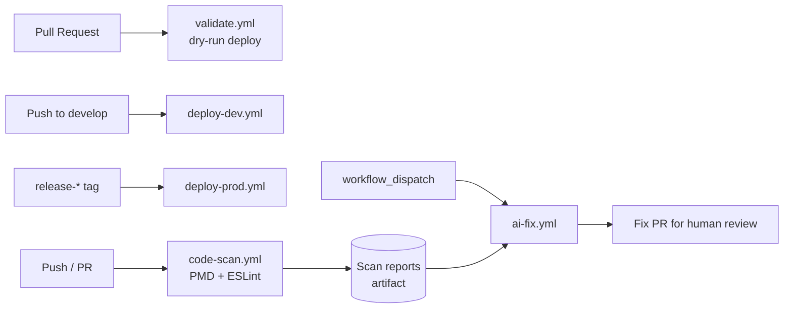

# Salesforce CI/CD Toolkit

[](LICENSE)
[](https://developer.salesforce.com/tools/salesforcecli)
[](https://forcedotcom.github.io/sfdx-scanner/)
[](https://github.com/mikehsin/salesforce-cicd-toolkit/pulls)

A drop-in set of **GitHub Actions workflows** and **helper scripts** that bring a
complete CI/CD pipeline to any Salesforce DX project: PR validation, dev/prod
deployment, static code analysis, and an AI-assisted bot that opens fix PRs for
Critical PMD/ESLint violations.

Copy `.github/workflows/` and `scripts/` into your SFDX repo, wire up a handful
of secrets, and you have validation, deployment, and code-quality automation
running on every push and pull request.

---

## Table of Contents

- [Why this toolkit](#why-this-toolkit)
- [What's included](#whats-included)
- [Architecture](#architecture)
- [Requirements](#requirements)
- [Quick Start](#quick-start)
- [Configuration reference](#configuration-reference)
- [Workflow details](#workflow-details)
- [How the AI auto-fix bot works](#how-the-ai-auto-fix-bot-works)
- [Security notes](#security-notes)
- [Contributing](#contributing)
- [License](#license)

## Why this toolkit

Salesforce DX projects rarely ship with production-grade CI/CD out of the box.
This toolkit packages the pieces most teams end up building by hand:

- **Dry-run validation** on every pull request, so bad deployments never reach `main`.
- **Environment-based deployment** — push to `develop` to deploy to a sandbox, tag a release to ship to production.
- **Static analysis** with Salesforce Code Analyzer (PMD for Apex, ESLint for LWC/Aura), published as a build artifact and a job summary.
- **An AI-assisted fixer** that reads Critical violations and opens a human-reviewed PR with minimal, line-scoped fixes — never an auto-merge.

## What's included

| File | Purpose |
|---|---|
| `.github/workflows/validate.yml` | Dry-run deploy validation on every PR into `main`/`develop` |
| `.github/workflows/deploy-dev.yml` | Deploy to a dev/sandbox org on push to `develop` |
| `.github/workflows/deploy-prod.yml` | Deploy to production when a `release-*` tag is pushed |
| `.github/workflows/code-scan.yml` | Run Salesforce Code Analyzer (PMD + ESLint), publish JSON/HTML/CSV reports as artifacts and a job summary |
| `.github/workflows/ai-fix.yml` | Pull the latest scan report, ask an LLM to fix Critical violations line-by-line, open a PR |
| `scripts/ai_fix.py` | Core auto-fix logic — batches violations, calls an OpenAI-compatible API, splices fixes back into source |
| `scripts/summarize_scan.py` | Renders a scan report as a Markdown table for the GitHub Actions job summary |

## Architecture



## Requirements

- A Salesforce DX project (`sfdx-project.json`, `force-app/`, `manifest/package.xml`)
- [`sf` (Salesforce CLI)](https://developer.salesforce.com/tools/salesforcecli) — installed automatically by every workflow
- An OpenAI-compatible LLM API (NVIDIA NIM, OpenAI, or any compatible endpoint) — only needed for `ai-fix.yml`

## Quick Start

1. **Copy the toolkit** into your Salesforce DX repo:

   ```bash
   cp -r .github/workflows <your-sfdx-repo>/.github/workflows
   cp -r scripts <your-sfdx-repo>/scripts
   ```

2. **Set up local testing (optional).** Copy `.env.example` to `.env` — never commit the real `.env`, it's already gitignored.

3. **Add GitHub Actions Secrets** (*Settings → Secrets and variables → Actions*):

   | Secret | Used by | Required |
   |---|---|---|
   | `SF_AUTH_URL` | `validate.yml` | Yes |
   | `SF_AUTH_URL_DEV` | `deploy-dev.yml` | Yes |
   | `SF_AUTH_URL_PROD` | `deploy-prod.yml` | Yes |
   | `AI_API_KEY` | `ai-fix.yml` | Only if you use the AI fixer |

   Generate a Salesforce auth URL for each org with:

   ```bash
   sf org display --verbose --json --target-org <alias> | jq -r '.result.sfdxAuthUrl'
   ```

4. **(Optional) Add repo variables** to point the AI fixer at a different provider or model:

   | Variable | Default |
   |---|---|
   | `AI_BASE_URL` | `https://integrate.api.nvidia.com/v1` |
   | `AI_MODEL` | `meta/llama-3.1-8b-instruct` |

5. **Tune the Apex test level.** `validate.yml`/`deploy-prod.yml` default to `RunLocalTests`; switch to
   `RunSpecifiedTests --tests <YourTestClass>` in the workflow file for faster PR validation if your org allows it.

## Configuration reference

| Trigger | Workflow | Target |
|---|---|---|
| Pull request → `main`/`develop` | `validate.yml` | Dry-run only, no org changes |
| Push → `develop` | `deploy-dev.yml` | Dev/sandbox org |
| Tag matching `release-*` | `deploy-prod.yml` | Production org |
| Push/PR → `main`/`develop` | `code-scan.yml` | Reports only, no org access |
| Manual dispatch | `ai-fix.yml` | Opens a PR, no org access |

## Workflow details

<details>
<summary><code>validate.yml</code> — PR validation</summary>

Runs a `sf project deploy start --dry-run` against the org identified by `SF_AUTH_URL` on every
pull request targeting `main` or `develop`. Supports a manual `workflow_dispatch` with a
selectable `test_level` (`RunLocalTests` / `RunAllTestsInOrg` / `NoTestRun`).
</details>

<details>
<summary><code>deploy-dev.yml</code> — Dev deployment</summary>

Deploys `manifest/package.xml` to the org identified by `SF_AUTH_URL_DEV` on every push to
`develop`, with `--test-level NoTestRun` for fast iteration.
</details>

<details>
<summary><code>deploy-prod.yml</code> — Production deployment</summary>

Deploys `manifest/package.xml` to the org identified by `SF_AUTH_URL_PROD` whenever a tag
matching `release-*` is pushed, running `RunLocalTests`. Gate this further with a GitHub
Environment (`production`) and required reviewers if you want a manual approval step.
</details>

<details>
<summary><code>code-scan.yml</code> — Static analysis</summary>

Runs Salesforce Code Analyzer (`sf scanner run`) with the PMD and ESLint engines against
`force-app/`, on every push/PR to `main`/`develop` and on manual dispatch. Publishes
JSON/HTML/CSV reports as a 30-day build artifact and writes a Markdown summary of the top
violations to the job summary.
</details>

<details>
<summary><code>ai-fix.yml</code> — AI-assisted auto-fix</summary>

See [How the AI auto-fix bot works](#how-the-ai-auto-fix-bot-works) below.
</details>

## How the AI auto-fix bot works

1. Trigger manually (`workflow_dispatch`) with a `batch_size` (how many Critical violations to
   attempt) and `base_branch` (where the fix PR should land).
2. Downloads the most recent successful `code-scan.yml` artifact.
3. For each Critical violation, sends the single offending line plus its rule and message to the
   LLM and asks for a minimal, in-place replacement.
4. Re-runs the scanner after fixes and opens a PR with a before/after summary and token usage —
   or exits quietly if nothing needed fixing.

> **This does not auto-merge.** Every fix lands in a PR for human review — treat LLM-generated
> Apex fixes as a first draft, not a trusted patch.

## Security notes

- `.env` is gitignored by default — never commit real credentials.
- Secrets are read from GitHub Actions Secrets at runtime and are never hardcoded in the workflows.
- The AI fixer only modifies files under `force-app/` and only opens pull requests — it never
  pushes directly to a protected branch and never merges on its own.

## Contributing

Issues and pull requests are welcome. If you're proposing a change to a workflow file, please
describe the trigger conditions and org permissions it needs, since that's the part most likely
to affect other consumers of this toolkit.

## License

MIT — see [LICENSE](LICENSE).
